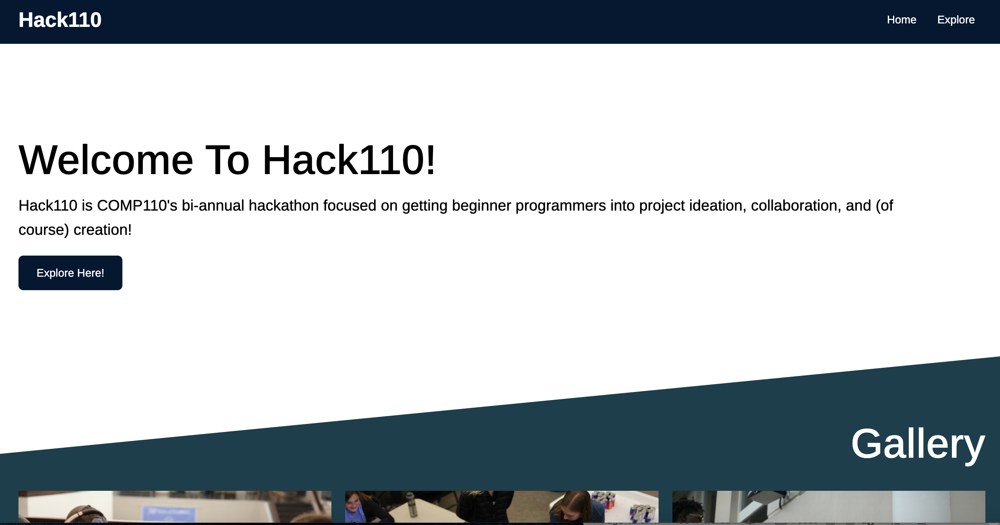

# Hack110 Spring 2022 Web Dev HTML/CSS Template

For COMP110 bi-annual beginner-friendly hackathon, HACK110. This is a basic website that highlights fundamental HTML and CSS styling components to help students taking the Web Dev track.

###NOTE:
This is soley a HTML and CSS **GUIDE** to help you UNDERSTAND what each component does. We recommend using this repo to play around with HTML and CSS but **NOT as the repo for your project**. Use a new repo or the repo you created during the Web Dev workshop that includes Flask. In addition, this repo doesn't include the Flask framework, which is what we want your projects to include! Go to https://hack.comp110.com/ to find the writeup for the Web Dev tutorial and see how to integrate Flask with HTML and CSS files.

## How to view on VSCode

1. Click on the Green Button on the top right name `Code`.
2. Copy the HTTPS url given
3. Open VSCode and click on `Clone Git Repository...` and paste the HTTPS url.
4. Open the workspace and download `Live Server` on Extensions Page (5th icon down on the left toolbar)
5. Go to `index.html`
6. Right click anywhere on the page and select `Open with Live Server` and a localhost file should appear on your browser.
7. If you make changes and save files, you should see changes update on your browser.

###NOTE
In Flask and your projects, you will type the command `python -m app` in your terminal to view your page. Since this is simply an HTML file, we are using a Live Server extension to help us preview the page.
